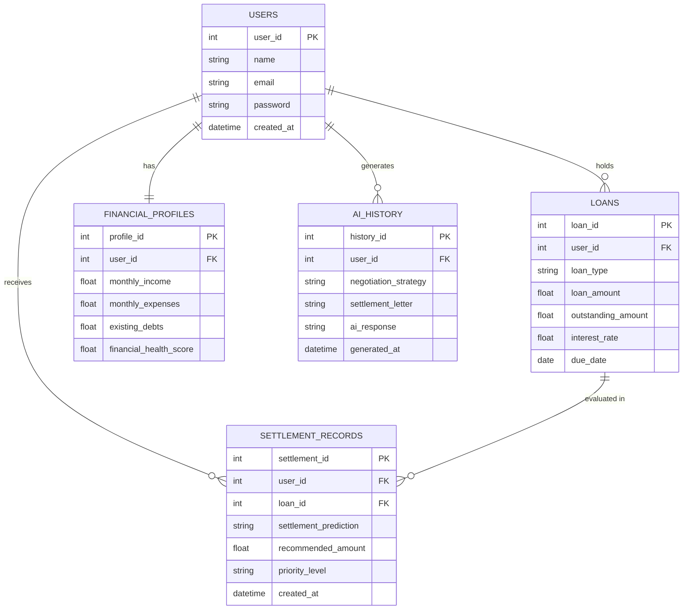

# Design and Analysis of ER Diagram — FinRelief AI

> Matches the official task description on SkillWallet
> ("Design and Analysis of ER Diagram for FinRelief AI") exactly —
> 5 entities, their attributes, primary/foreign keys, relationships,
> and analysis.

## 1. Entities Involved

The diagram consists of **five primary entities**:

- **Users** — represents borrowers registered on the FinRelief AI platform.
- **Loans** — stores loan information, repayment details, and borrower liabilities.
- **Financial_Profiles** — maintains borrower financial information used for settlement analysis.
- **Settlement_Records** — stores settlement predictions, recommendations, and negotiation outcomes.
- **AI_History** — maintains AI-generated negotiation strategies, settlement letters, and interaction history.

## 2. Attributes

### Users
| Attribute | Notes |
|---|---|
| user_id | **PK** — uniquely identifies each borrower |
| name | Borrower name |
| email | Borrower email address |
| password | Encrypted password for authentication |
| created_at | Account creation timestamp |

### Loans
| Attribute | Notes |
|---|---|
| loan_id | **PK** — uniquely identifies each loan record |
| user_id | **FK** → Users |
| loan_type | Type of loan |
| loan_amount | Total loan amount |
| outstanding_amount | Remaining balance |
| interest_rate | Applicable interest rate |
| due_date | Loan repayment deadline |

### Financial_Profiles
| Attribute | Notes |
|---|---|
| profile_id | **PK** — uniquely identifies each borrower financial profile |
| user_id | **FK** → Users |
| monthly_income | Borrower income |
| monthly_expenses | Borrower expenses |
| existing_debts | Existing liabilities |
| financial_health_score | Calculated financial score |

### Settlement_Records
| Attribute | Notes |
|---|---|
| settlement_id | **PK** — uniquely identifies each settlement prediction record |
| user_id | **FK** → Users |
| loan_id | **FK** → Loans |
| settlement_prediction | Predicted settlement possibility |
| recommended_amount | Suggested settlement amount |
| priority_level | Loan settlement priority |
| created_at | Record creation timestamp |

### AI_History
| Attribute | Notes |
|---|---|
| history_id | **PK** — uniquely identifies each AI-generated interaction record |
| user_id | **FK** → Users |
| negotiation_strategy | AI-generated negotiation strategy |
| settlement_letter | Generated negotiation letter |
| ai_response | AI recommendation output |
| generated_at | Interaction timestamp |

## 3. Relationships

| Relationship | Cardinality | Meaning |
|---|---|---|
| Users → Loans | 1 : N | One borrower can have multiple loans; each loan belongs to a single borrower. |
| Users → Financial_Profiles | 1 : 1 | Each borrower has one financial profile associated with their account. |
| Users → Settlement_Records | 1 : N | One borrower can receive multiple settlement predictions and recommendations. |
| Users → AI_History | 1 : N | One borrower can generate multiple AI-powered negotiation sessions. |
| Loans → Settlement_Records | 1 : N | One loan may have multiple settlement evaluation records. |

## 4. Foreign Keys Summary

- `Loans.user_id` → references **Users**
- `Financial_Profiles.user_id` → references **Users**
- `Settlement_Records.user_id`, `Settlement_Records.loan_id` → reference **Users** and **Loans**
- `AI_History.user_id` → references **Users**

## 5. Mermaid ER Diagram

> Paste the block above (without backticks) into [mermaid.live](https://mermaid.live)
> and export as PNG for your submission.

## 6. Cardinality Summary

One borrower can own multiple loans, settlement records, and AI-generated
negotiation sessions. Each loan, settlement record, and AI interaction is
associated with only one borrower.

## 7. Normalization and Structure

The design separates borrower details, loan information, financial
profiles, settlement records, and AI-generated history into independent
entities. This reduces redundancy, improves data integrity, and keeps
database operations efficient — every non-key attribute depends only on
its own entity's primary key (3NF).

## 8. Use Case Coverage

This ER model supports the core functionality of the FinRelief AI platform:

1. Borrower registration and authentication
2. Loan management and tracking
3. Financial profile assessment
4. Settlement prediction and recommendation generation
5. AI-powered negotiation strategy creation
6. Settlement letter generation
7. Historical AI interaction tracking
8. Financial recovery analytics and reporting

## 9. Scalability and Cloud Relevance

Separating borrower, loan, settlement, and AI-generated records into
distinct entities supports scalable financial recovery operations and
future integration with cloud databases (PostgreSQL, MySQL, DynamoDB,
Firebase), while keeping room for advanced analytics, reporting, and
AI-driven financial assistance features.

## 10. Mapping to the codebase

Implemented in `backend/app/models.py` via SQLAlchemy: each entity above
= one table (`User`, `Loan`, `FinancialProfile`, `SettlementRecord`,
`AIHistory`), each FK = a `ForeignKey` + `relationship()` pair. The
backend build in **Epic 1** uses these exact names going forward.
